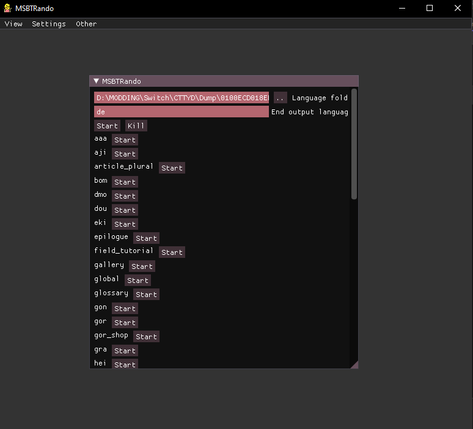

# Msbt Randomizer

Tested with Paper Mario: The Thousand Year Door (Remake)

MSBT files are files that contains games text used in Nintendo games.
The tool can translate most of the text to random languages and then translate it back to english/or any other language.

## How?

With [CLMS](https://github.com/KillzXGaming/CLMS), the program can open and edit `.msbt` files.

1. The C# program opens the `.msbt` file.
2. A temporary file is created for a Python script (converted to an executable (Located at program-path/resources/)) to translate the content to random languages and back using [deep-translator](https://pypi.org/project/deep-translator/).
3. The C# program converts the new temporary file back to `.msbt` format.

I use both C# and Python because I couldn't find a C# package that doesn't require an API key.

## Setup

1. **Download** the newest release from the Releases tab and unzip it.
2. **Open** the `MSBTRando.exe` file.
   - If it crashes make sure you have "[dotnet 8.0 runtime](https://dotnet.microsoft.com/en-us/download/dotnet/8.0)"
     installed for your platform, if it still doesn't start please report the error.
3. **Select** a language folder from your game `romfs` (you need to have a dump of your game `romfs`).
4. **Write** your desired output language code:
   - "en" for English
   - "de" for German
   - etc.
5. **Press** "Start".
6. **Press** "Start" for the file you want to auto-translate.
   - **Note:** Avoid starting too many file edits at once(Try it maybe with 3-10), as this can lead to Google timing you out for minutes or even days.
7. **Wait** for the process to complete. This can take 30 minutes to 1 hour or more.
8. Once finished, you should have an output folder with every `.msbt` file in it, located in the same path as your `MSBTRando.exe`.
9. **Load** the output folder as a mod (with the correct path).

**Note:** Keep an eye on the console for any errors because it's only a test release.

Have fun!

## Why?
Just for fun it can lead to very funny results.
